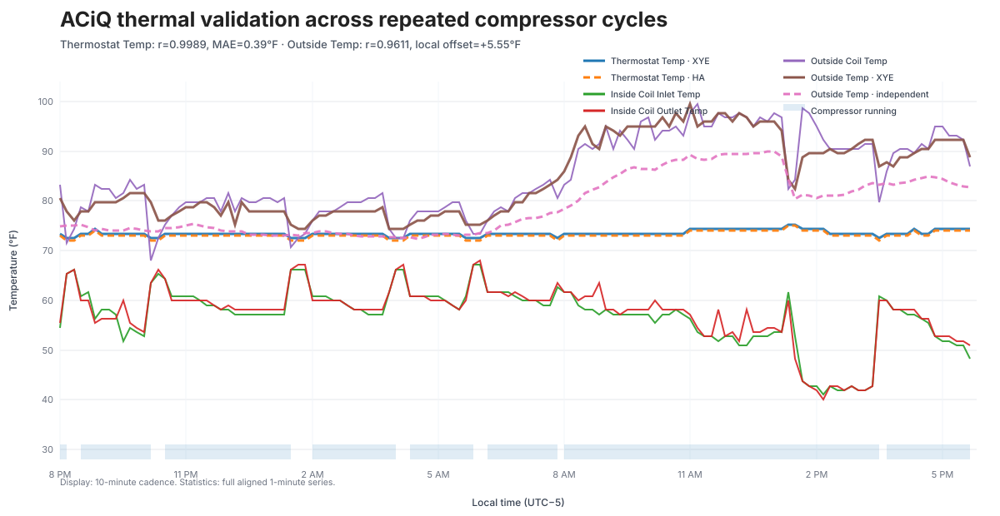
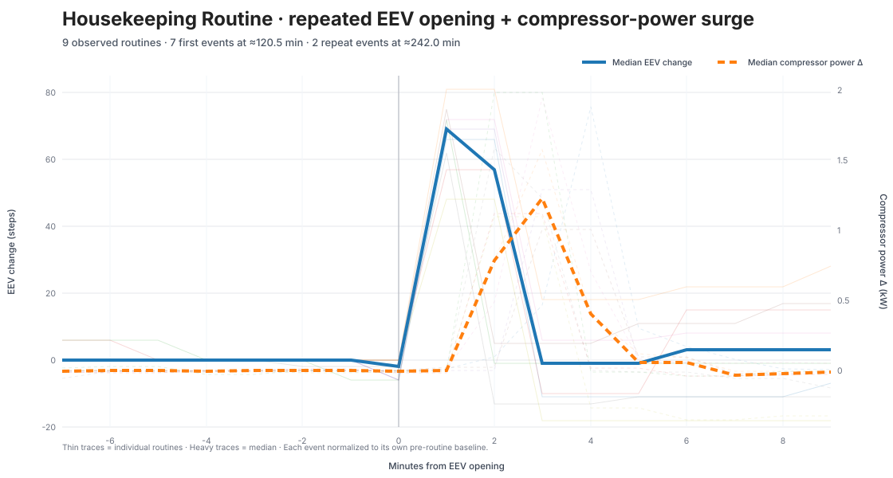

# ACiQ Extreme+ XYE field map

This document records a validated field map for the ACiQ Extreme+ ducted heat-pump family using the Midea-style XYE bus.

Tested hardware:

- ACIQ-48-PAH air handler
- ACIQ-48-HPD outdoor unit
- XYE / RS-485, 4800 baud, 8N1

The mappings below come from live bus captures, Home Assistant history, controlled mode/fan tests, independent electrical measurements, and refrigeration behavior over repeated cycles. Fields that remain unresolved stay raw rather than receiving speculative labels.



The graph shows the decoded temperature sensors together across repeated compressor cycles. Display traces are downsampled for readability; the correlation statistics use the full aligned one-minute history.

## Validation summary

- **Thermostat Temp / C0 B11:** Pearson `r = 0.9989` against thermostat history, with about **0.39 °F mean absolute error** across 1,310 aligned samples. `r` is a correlation coefficient on a -1..+1 scale, not a percentage.
- **Inside Coil Inlet / Outlet / C0 B12-B13:** separate under active refrigeration, move together through load changes, and converge as the compressor stops.
- **Outside Coil Temp / C0 B14:** follows outdoor heat-exchanger thermal behavior across compressor cycles.
- **Outside Temp / C4 B21:** Pearson `r = 0.9611` against a separate outdoor sensor across 2,635 aligned samples. The unit-mounted sensor averaged about **5.55 °F warmer**, consistent with sensor placement rather than a different measured quantity.
- **Compressor Running / C0 B19:** tracks independent compressor electrical operation and thermostat HVAC action.
- **EEV Position / C0 B28:B29:** a single little-endian step value with smooth 255/256 crossings, repeatable stepper-like movement, load modulation, and a 480-step parking endpoint. Observed range is roughly **177..480 steps**.
- **C0/C4 mode, fan, and setpoint fields:** repeatedly matched commanded operating states across OFF, FAN, DRY, HEAT, COOL, and AUTO tests.

## Confidence legend

- **Very high:** repeated direct correlation with commanded state, independent measurement, and/or physically expected refrigeration behavior with no credible competing interpretation.
- **High:** repeatable behavior plus strong protocol or refrigeration evidence, but some semantic detail remains unresolved.
- **Medium:** useful working interpretation that has not been independently pinned down to the same degree.
- **Unknown:** preserve the raw value rather than assigning a speculative meaning.
- **Low usefulness / Unused here:** a generic protocol slot that does not expose useful live telemetry on the tested ACiQ hardware.

## Recommended Home Assistant names

The generic `midea_xye` component already exposes most of the useful sensors. Suggested names for an ACiQ installation are:

| Component field | Friendly name |
|---|---|
| internal current temperature / T1 | **Thermostat Temp** |
| temperature_2a / T2A | **Inside Coil Inlet Temp** |
| temperature_2b / T2B | **Inside Coil Outlet Temp** |
| temperature_3 / T3 | **Outside Coil Temp** |
| outdoor_temperature / T4 | **Outside Temp** |
| compressor_active / C0 B19 | **Compressor Running** |
| C0 B28:B29 | **EEV Position** |
| C0 B09 decoded | **Actual Fan Mode** |
| C4 B17 decoded | **Target Fan Mode** |

`examples/aciq-extreme-plus.yaml` adds only the ACiQ-specific entities that are not already exposed by the generic component.

Example climate configuration:

```yaml
climate:
  - platform: midea_xye
    id: heatpump_xye
    name: Heat Pump
    use_fahrenheit: true

    internal_current_temperature:
      name: Thermostat Temp
    temperature_2a:
      name: Inside Coil Inlet Temp
    temperature_2b:
      name: Inside Coil Outlet Temp
    temperature_3:
      name: Outside Coil Temp
    outdoor_temperature:
      name: Outside Temp
    compressor_active:
      name: Compressor Running
    defrost:
      name: Defrost Active
    error_flags:
      name: Error Flags
    protect_flags:
      name: Protection Flags
    fan_speed:
      name: Fan Speed

    compressor_aware_action: true
    sync_fan_mode_from_device: true
```

The final two settings are generic opt-ins rather than ACiQ requirements. They are recommended on the tested system because C0 B19 and the defrost state have been validated well enough for compressor-aware Home Assistant actions, while C4 B17 preserves the thermostat's commanded fan mode even when the C0 actual fan state goes idle. Leaving either option at its default preserves the component's legacy behavior.

The add-on profile can then be included as an ESPHome package and requires the climate ID `heatpump_xye`.

## C0 basic query payload

Absolute receive-frame positions are shown below. Payload is bytes 6..29.

| Byte | Interpretation | Observed ACiQ behavior | Confidence |
|---|---|---|---|
| B06 | Unknown/configuration | commonly 48 | Unknown |
| B07 | Capabilities | commonly 20 | Medium |
| B08 | Operating mode | OFF=0x00, FAN=0x81, DRY=0x82, HEAT=0x84, COOL=0x88, AUTO observed as 0x98 | Very high |
| B09 | Actual fan state | bit7=AUTO; low nibble: 0=off, 1=high, 2=medium, 3/4=low | Very high |
| B10 | Target temperature | integer Celsius setpoint on the tested ACiQ; this is a setpoint byte, not the `(raw - 40) / 2` sensor-temperature encoding | Very high |
| B11 | Thermostat / T1 temperature | `(raw - 40) / 2` °C | Very high |
| B12 | Inside coil inlet / T2A | `(raw - 40) / 2` °C | Very high |
| B13 | Inside coil outlet / T2B | `(raw - 40) / 2` °C | Very high |
| B14 | Outside coil / T3 | `(raw - 40) / 2` °C | Very high |
| B15 | Current field / unsupported sentinel | 0xFF on tested system; do not interpret as 255 A | High |
| B16 | Unknown/reserved | 0 | Unknown |
| B17 | Start timer | usually 0 | Medium |
| B18 | Stop timer | usually 0 | Medium |
| B19 | Compressor running | 0=idle, 1=running | Very high |
| B20 | Mode flags | usually 0 | Medium |
| B21 | Operation flags | usually 0 | Medium |
| B22-23 | Error flags, little-endian | 0 in normal operation | High |
| B24-25 | Protection flags, little-endian | 0 in normal operation | High |
| B26 | CCM communication/error field | 0 in current captures | Medium |
| B27 | Unknown/configuration | 0 | Unknown |
| B28-29 | **EEV position, little-endian steps** | dynamic ~177..480, smooth 16-bit transitions, repeatable stepper motion, parks at 480 | **Very high** |

### Setpoint encoding note

C0 B10 is deliberately different from B11-B14. B11-B14 are physical sensor temperatures and use the Midea XYE sensor encoding `(raw - 40) / 2` °C. In the captured ACiQ C0 frames, B10 instead tracks the commanded setpoint directly as integer Celsius.

The generic component also supports a status bit on Celsius setpoint bytes (`0x40`, masked with `0xBF`) and a Fahrenheit setpoint encoding for units that report it that way. The ACiQ profile does not decode B10 itself, and the tested configuration uses C4 as the normal target-temperature source, so this distinction does not alter climate control.

### EEV position

Decode:

```text
EEV = B28 | (B29 << 8)
```

Observed behavior on the tested system:

- smooth transitions across the 255/256 byte boundary establish a single 16-bit value
- shutdown repeatedly moves toward 480 in approximately 62/63-step increments
- startup moves away from 480 toward the operating position before compressor operation stabilizes
- steady running shows smaller control corrections as refrigeration load changes
- the value opens abruptly during the recurring Housekeeping Routine while compressor power rises

On this bus the field is **EEV Position**.

## C4 extended query payload

| Byte | Interpretation | Observed ACiQ behavior | Confidence |
|---|---|---|---|
| B06 | Indoor fan PWM protocol slot | 0 despite large real blower-power changes | Low usefulness |
| B07 | Indoor fan tach protocol slot | 0 despite large real blower-power changes | Low usefulness |
| B08 | Unknown/fixed field | 0x80 across compressor on/off states | Unknown |
| B09 | ESP/profile field | 0x30 | Medium |
| B10 | Unknown/fixed/protection-style field | 0x8C across normal state changes | Unknown |
| B11-B14 | Generic engineering slots | 0 on tested unit | Unused here |
| B15 | Reserved | 0 | Unknown |
| B16 | Operating mode/state | OFF=0x01, FAN=0x81, DRY=0x82, HEAT=0x84, COOL=0x88, AUTO=0x90; 0x08 observed while disabling COOL | Very high |
| B17 | Target/commanded fan | same fan encoding family as C0 | Very high |
| B18 | Target temperature | tested Fahrenheit mode: `°F = raw - 135`; equivalent `°C = ((raw - 135) - 32) × 5/9`. Generic Celsius mode uses `raw & 0xBF` °C, but that path was not separately validated on this ACiQ | Very high for tested Fahrenheit encoding |
| B19-20 | Fixed metadata/signature | 0xBCD6 / 48342 in all current captures | High that it is not live telemetry |
| B21 | Outside / T4 temperature | `(raw - 40) / 2` °C | Very high |
| B22-B23 | Reserved | 0 | Unknown |
| B24 | Static-pressure/profile protocol field | 0 despite large blower-power changes | Low as measured static pressure |
| B25 | Reserved | 0 | Unknown |
| B26-B29 | Unknown/static fields | 0x80 in all captured ACiQ states | Unknown |

C4 B18 is the target-temperature representation actually validated on the Fahrenheit-configured test system. The Celsius-mode expression above documents the component's generic decoder rather than a separate ACiQ Celsius-mode experiment.

## Fan behavior

C0 B09 reports the actual running fan state:

- bit 7 (`0x80`) indicates automatic fan control
- low nibble reports physical speed
- 0x01 = HIGH
- 0x02 = MEDIUM
- 0x03 or 0x04 = LOW
- 0x00 = OFF

Examples observed on the tested ACiQ:

- `0x84` = AUTO + LOW
- `0x82` = AUTO + MEDIUM
- `0x81` = AUTO + HIGH
- bare `0x04`, `0x02`, `0x01` = manual LOW/MEDIUM/HIGH

C4 B17 is the target/commanded fan setting and can remain AUTO while C0 shows the physical speed selected underneath AUTO.

## Housekeeping Routine



Nine observed routines show the same EEV-opening and compressor-power choreography:

- seven first routines occur at approximately **120.5 minutes** of uninterrupted compressor operation
- two long runs show a repeat routine at approximately **242.0 minutes**
- cooling remains active rather than entering the defrost state
- EEV Position opens abruptly by roughly 50-80 steps
- independent compressor electrical power rises markedly immediately afterward
- EEV Position returns toward its previous modulation range
- protection flags remain clear in the observed cooling events
- the component's defrost entity remains off

Midea-family literature describes oil/lubricant-return logic using the same general ingredients: prolonged low-frequency runtime, compressor-frequency increase, and EEV movement. The project calls the observed event **Housekeeping Routine**; oil return is the best engineering interpretation.

No dedicated Housekeeping flag has been identified on C0/C4, so the example profile does not synthesize one.

## Filter / blower experiment

A large real-world airflow-resistance change did not move C4 B06, B07, or B24 on the tested air handler:

| Air path | Approx. air-handler power | XYE fan state |
|---|---:|---|
| No filter | ~65 W | AUTO + LOW |
| Disposable MERV 11 | ~80 W | AUTO + LOW |
| Restrictive washable MERV 11 | ~150 W | AUTO + LOW |

This suggests the indoor ECM performs substantial local torque/RPM/static compensation that these XYE fields do not expose on this air handler.

## Runtime validation

The final clean configuration was compiled, flashed, and run continuously on the tested ACIQ-48-PAH / ACIQ-48-HPD system for two days with no observed climate-control regressions.
